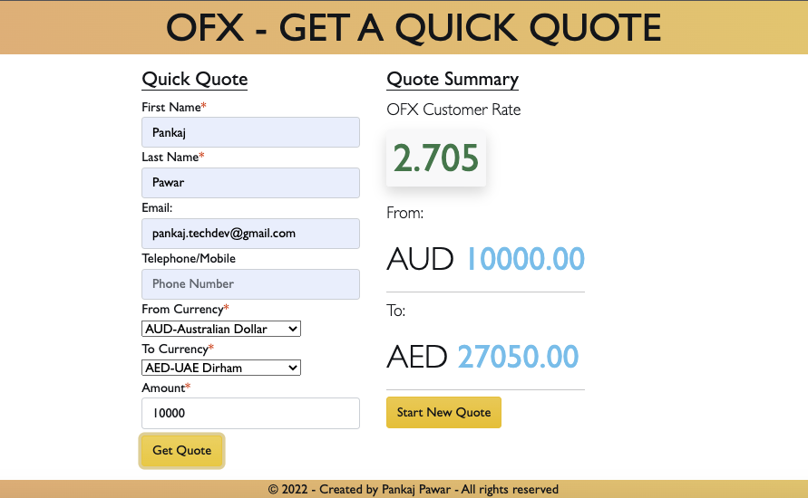
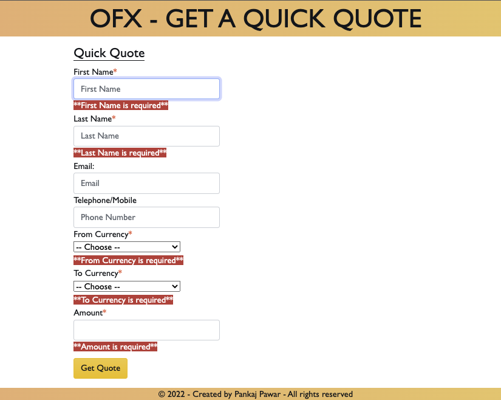

# Get Currency Conversion Quote App

A simple single page app built in React that will allow users to:

- Retrieve and display the quote price
- Start a new quote

## Deployed on Netlifty:

Live App link: [https://get-currency-conversion-quote.netlify.app/](https://get-currency-conversion-quote.netlify.app/)

The app uses bootstrap for styling components.
For Form, external package called "react-hook-form" has been used. This allows for better form validation.

## Available Scripts

In the project directory, you can run:

### `npm start`

Runs the app in the development mode.\
Open [http://localhost:3000](http://localhost:3000) to view it in your browser.

The page will reload when you make changes.\
You may also see any lint errors in the console.

### `npm test`

Launches the test runner in the interactive watch mode.\
See the section about [running tests](https://facebook.github.io/create-react-app/docs/running-tests) for more information.
